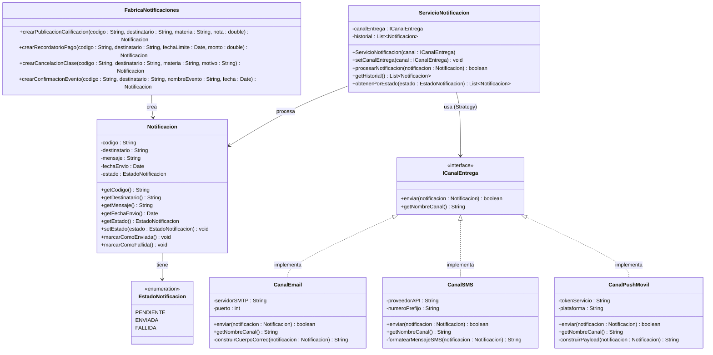
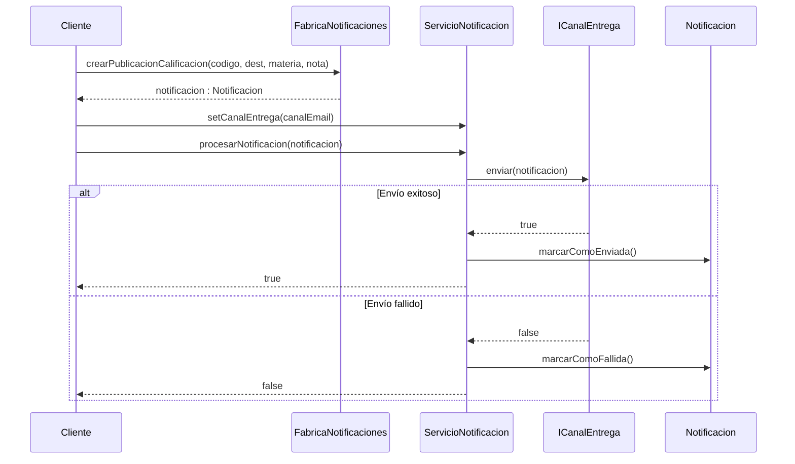
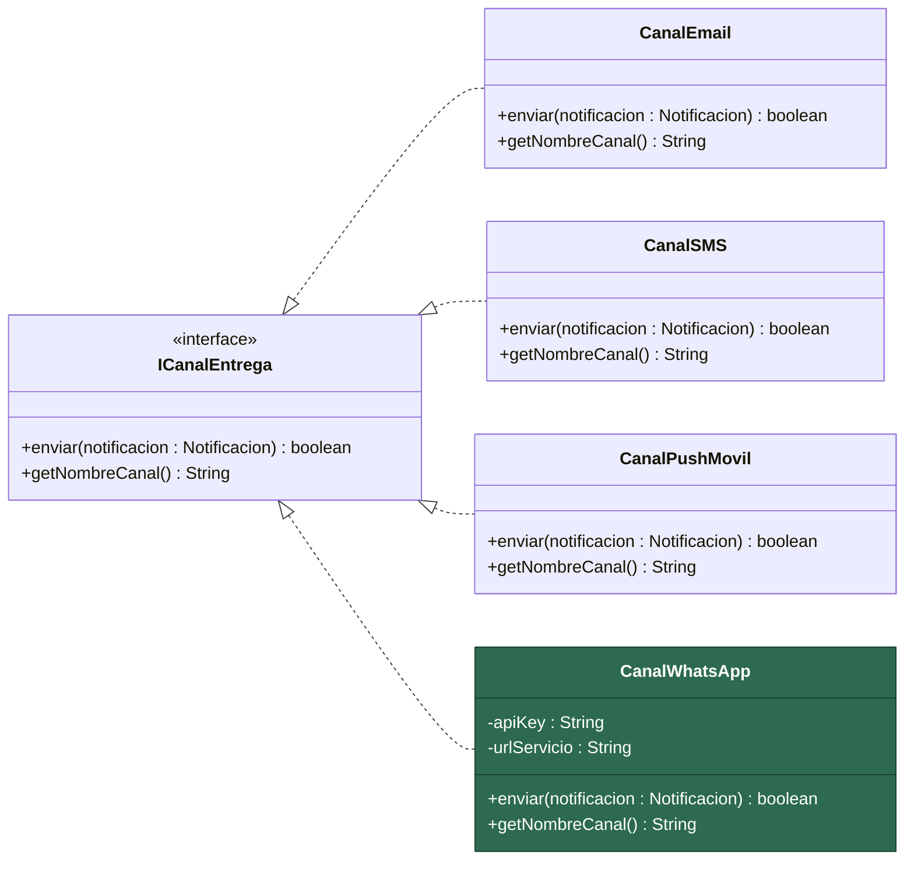
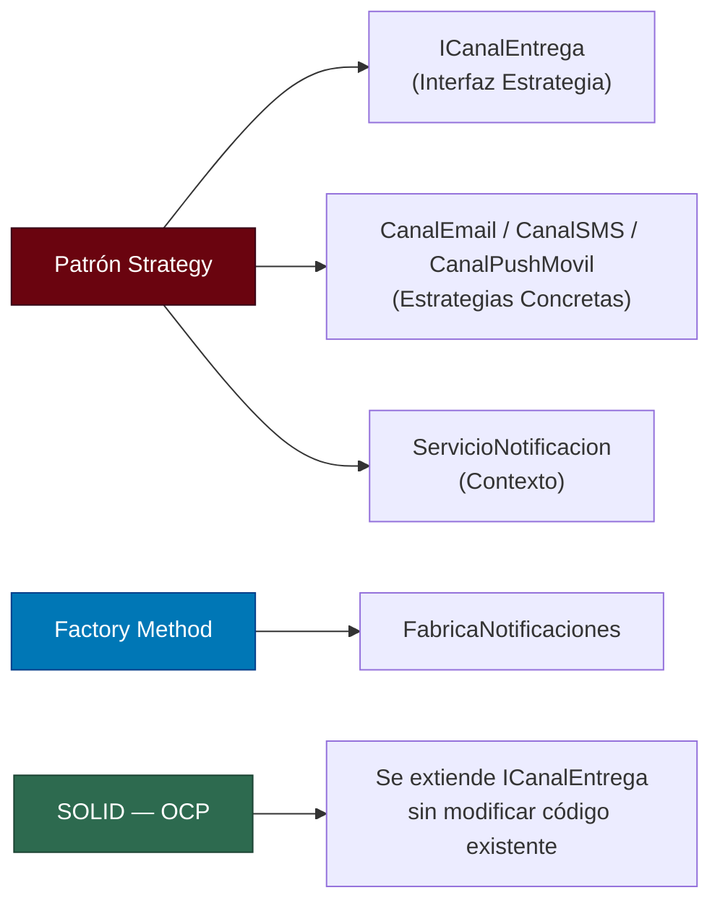

# 🏛️ Arquitectura Técnica — Sistema de Notificaciones Universitarias

> **Autor:** Arquitecto de Software Senior  
> **Fecha:** 22 de abril de 2026  
> **Versión:** 1.0  

---

## 1. Descripción General del Sistema

El **Sistema de Notificaciones Universitarias** es una plataforma diseñada para gestionar el envío de notificaciones académicas y administrativas a los miembros de la comunidad universitaria. El sistema soporta múltiples **tipos de notificación** (situaciones) y múltiples **canales de entrega**, manteniendo una arquitectura extensible y desacoplada.

### 1.1 Situaciones de Notificación

| Situación                      | Descripción                                                     |
| ------------------------------ | --------------------------------------------------------------- |
| Publicación de Calificaciones  | Notifica al estudiante cuando se publican notas de una materia. |
| Recordatorio de Pago Matrícula | Aviso de fechas próximas de pago o vencimiento de matrícula.    |
| Cancelación de Clase           | Informa sobre la suspensión de una sesión de clase.             |
| Confirmación de Evento         | Confirma la inscripción o asistencia a un evento universitario. |

### 1.2 Canales de Entrega

| Canal                          | Descripción                                       |
| ------------------------------ | ------------------------------------------------- |
| Correo Electrónico (Email)     | Envío de notificación vía correo institucional.    |
| SMS                            | Envío de mensaje de texto al celular del usuario.  |
| Notificación Push (App Móvil)  | Envío mediante push notification a la app móvil.   |

### 1.3 Datos Centrales de una Notificación

| Atributo       | Tipo     | Descripción                                          |
| -------------- | -------- | ---------------------------------------------------- |
| `codigo`       | `String` | Identificador único de la notificación.              |
| `destinatario` | `String` | Nombre o identificación del receptor.                |
| `mensaje`      | `String` | Contenido textual de la notificación.                |
| `fechaEnvio`   | `Date`   | Fecha y hora en que se realizó el envío.             |
| `estado`       | `Enum`   | Estado actual: `PENDIENTE`, `ENVIADA`, `FALLIDA`.    |

---

## 2. Justificación de la Arquitectura

### 2.1 Problema Arquitectónico

El sistema enfrenta un problema clásico de diseño: existen **dos dimensiones independientes de variación**:

1. **Qué se notifica** → El tipo/contenido de la notificación (calificación, pago, cancelación, evento).
2. **Cómo se entrega** → El canal de entrega (email, SMS, push).

Si combinamos ambas dimensiones mediante herencia directa, se produce una **explosión combinatoria de clases** (4 tipos × 3 canales = 12 clases concretas). Cada nuevo tipo o canal multiplicaría el número de clases y violaría el principio de responsabilidad única.

### 2.2 Patrón Elegido: Strategy (Estrategia)

Se adopta el **Patrón Strategy** para desacoplar completamente el **contenido de la notificación** de su **mecanismo de entrega**.

#### ¿Por qué Strategy y no Bridge?

| Criterio                     | Strategy                                     | Bridge                                        |
| ---------------------------- | -------------------------------------------- | --------------------------------------------- |
| Complejidad                  | Menor — una sola interfaz de estrategia      | Mayor — requiere abstracción + implementación  |
| Foco                         | Intercambiar algoritmos de envío en ejecución | Desacoplar dos jerarquías paralelas            |
| Cambio dinámico de canal     | ✅ Sí, trivial                                | ✅ Sí, pero con más infraestructura            |
| Adecuación para este caso    | **Alta** — el canal es una estrategia pura   | Media — sobredimensionado para canales simples |

El canal de entrega encapsula un **algoritmo de envío** que varía independientemente del tipo de notificación. El patrón Strategy modela esta variación de forma limpia, permitiendo inyectar el canal deseado en tiempo de ejecución.

### 2.3 Principio Abierto/Cerrado (OCP — SOLID)

La arquitectura satisface el **Principio Abierto/Cerrado** de la siguiente manera:

- **Abierto para extensión:** Para añadir un nuevo canal (ej. WhatsApp, Telegram), basta con crear una nueva clase que implemente la interfaz `ICanalEntrega`. No se modifica ninguna clase existente.
- **Cerrado para modificación:** Las clases `Notificacion`, `ServicioNotificacion` y las estrategias existentes permanecen inalteradas al agregar extensiones.

```text
┌──────────────────────────────────────────────────────────────┐
│  ANTES de agregar WhatsApp:                                  │
│    ICanalEntrega ← CanalEmail, CanalSMS, CanalPush          │
│                                                              │
│  DESPUÉS de agregar WhatsApp:                                │
│    ICanalEntrega ← CanalEmail, CanalSMS, CanalPush,         │
│                    CanalWhatsApp  ← NUEVA (sin tocar nada)   │
└──────────────────────────────────────────────────────────────┘
```

### 2.4 Principios SOLID Aplicados

| Principio                          | Aplicación en el Sistema                                                                                    |
| ---------------------------------- | ----------------------------------------------------------------------------------------------------------- |
| **S** — Responsabilidad Única      | Cada canal tiene una sola responsabilidad: enviar por su medio. Cada tipo de notificación genera su mensaje. |
| **O** — Abierto/Cerrado           | Nuevos canales y tipos se agregan sin modificar código existente.                                            |
| **L** — Sustitución de Liskov     | Cualquier `ICanalEntrega` puede sustituirse sin alterar el comportamiento del servicio.                      |
| **I** — Segregación de Interfaces | `ICanalEntrega` define solo el método `enviar()`, evitando interfaces infladas.                              |
| **D** — Inversión de Dependencias | `ServicioNotificacion` depende de la abstracción `ICanalEntrega`, no de clases concretas.                    |

---

## 3. Diagrama UML de Clases



---

## 4. Diagrama de Secuencia — Flujo de Envío



---

## 5. Diagrama de Extensibilidad — Agregar Nuevo Canal

El siguiente diagrama ilustra cómo agregar un nuevo canal (por ejemplo, **WhatsApp**) sin modificar ninguna clase existente:



> **Nota:** La clase `CanalWhatsApp` (resaltada en verde) se agrega simplemente implementando `ICanalEntrega`. Ninguna otra clase del sistema requiere modificación. Esto demuestra en la práctica el **Principio Abierto/Cerrado**.

---

## 6. Descripción Detallada de Componentes

### 6.1 `Notificacion` — Entidad del Dominio

Representa el **dato fundamental** del sistema. Contiene toda la información necesaria para realizar un envío: identificador, destinatario, mensaje, fecha y estado. Es una clase simple, sin lógica de envío — su responsabilidad se limita a almacenar y exponer datos.

### 6.2 `EstadoNotificacion` — Enumeración

Define los tres estados posibles del ciclo de vida de una notificación:

- `PENDIENTE` → Creada pero aún no enviada.
- `ENVIADA` → Entregada exitosamente por el canal.
- `FALLIDA` → El envío presentó un error.

### 6.3 `ICanalEntrega` — Interfaz Estrategia

Es el **contrato abstracto** que todo canal de entrega debe cumplir. Define dos métodos:

- `enviar(notificacion)` → Ejecuta el envío por el medio correspondiente.
- `getNombreCanal()` → Retorna el nombre legible del canal (para auditoría/logs).

Al ser una interfaz, permite que el sistema dependa de una **abstracción** y no de implementaciones concretas.

### 6.4 Implementaciones Concretas de Canal

| Clase            | Canal             | Atributos Específicos                        |
| ---------------- | ----------------- | -------------------------------------------- |
| `CanalEmail`     | Correo electrónico | `servidorSMTP`, `puerto`                     |
| `CanalSMS`       | Mensaje de texto   | `proveedorAPI`, `numeroPrefijo`              |
| `CanalPushMovil` | Push notification  | `tokenServicio`, `plataforma`                |

Cada clase encapsula la lógica concreta de envío y los parámetros de configuración específicos de su tecnología.

### 6.5 `FabricaNotificaciones` — Factory

Encapsula la **creación de notificaciones** para cada tipo/situación. Centraliza la construcción del mensaje según el contexto (calificación, pago, cancelación, evento), evitando que la lógica de formato se disperse por el sistema.

### 6.6 `ServicioNotificacion` — Contexto del Patrón Strategy

Es el **orquestador principal**. Recibe una notificación y delega su envío al canal inyectado (`ICanalEntrega`). Sus responsabilidades son:

1. Recibir la notificación a procesar.
2. Delegar al canal de entrega actual.
3. Actualizar el estado de la notificación según el resultado.
4. Mantener un historial de notificaciones procesadas.

El canal puede cambiarse dinámicamente mediante `setCanalEntrega()`, lo que permite reutilizar el mismo servicio para distintos medios.

---

## 7. Resumen del Mapeo Patrón ↔ Componente



---

## 8. Pseudocódigo de Uso

```java
// === Ejemplo de uso del sistema ===

// 1. Crear la notificación usando la fábrica
Notificacion notif = FabricaNotificaciones.crearPublicacionCalificacion(
    "NOTIF-001",
    "estudiante@universidad.edu",
    "Programación Orientada a Objetos",
    4.5
);

// 2. Crear el canal de entrega deseado
ICanalEntrega canalEmail = new CanalEmail("smtp.universidad.edu", 587);

// 3. Configurar el servicio con el canal
ServicioNotificacion servicio = new ServicioNotificacion(canalEmail);

// 4. Procesar el envío
boolean resultado = servicio.procesarNotificacion(notif);
// → La notificación queda marcada como ENVIADA o FALLIDA automáticamente

// 5. Cambiar dinámicamente a otro canal (Strategy en acción)
ICanalEntrega canalSMS = new CanalSMS("api.twilio.com", "+57");
servicio.setCanalEntrega(canalSMS);
servicio.procesarNotificacion(notif); // Re-envío por SMS
```

---

## 9. Conclusión

La arquitectura propuesta logra:

- ✅ **Desacoplamiento total** entre tipos de notificación y canales de entrega.
- ✅ **Extensibilidad garantizada** mediante el Principio Abierto/Cerrado.
- ✅ **Intercambio dinámico** de canales gracias al Patrón Strategy.
- ✅ **Código limpio** con responsabilidades claras y bien definidas.
- ✅ **Escalabilidad futura** sin rediseño del sistema base.

> *"Un buen diseño no es aquel al que no se le puede agregar nada más, sino aquel al que no se le puede quitar nada."*  
> — Adaptación del principio de Antoine de Saint-Exupéry
